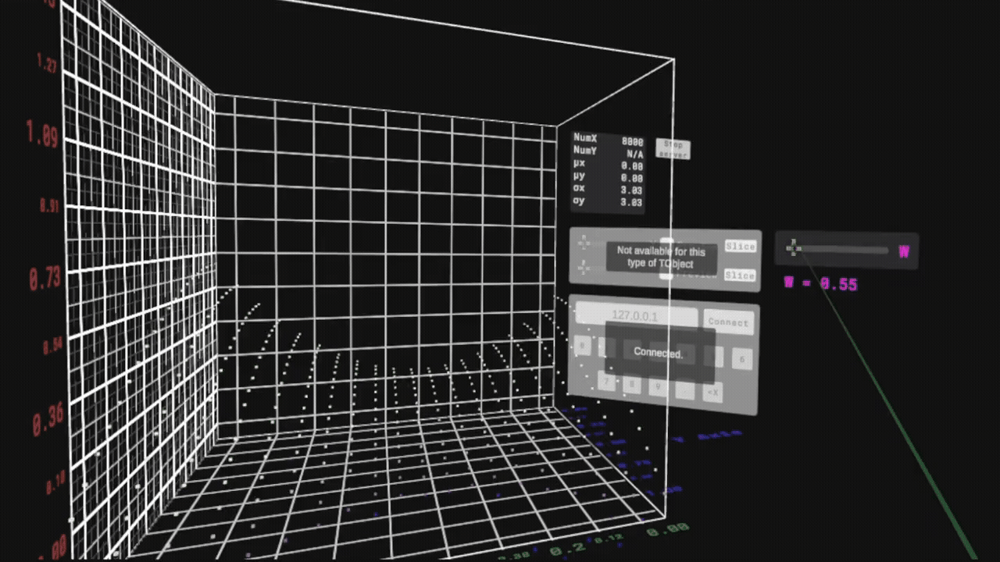

# ROOT VR Documentation
## VRGraph3D Class Reference

### Creating a VRGraph3D

The VRGraph3D class has 2 constructors, one copy constructor, and an assignment operation.

Given 4 arrays `x, y, z, w` of equal length `n`,
```
VRGraph3D* g3V = new VRGraph3D(n, x, y, z, w);
```
Points may be appended to the graph using the public `AddPoint` method.

The default constructor initializes all arrays as empty, and can be used as in
```
VRGraph3D* g3V = new VRGraph3D();
```

The copy constructor and assignment operator copy data from the provided ("other" or "rhs") VRGraph3D object into the one that called the copy constructor/assignment operator. For example:
```
VRGraph3D* g3V_0 = new VRGraph3D(n, x, y, z, w);
VRGraph3D g3V_1(g3V_0); //Copy constructor

VRGraph3D g3V_2;
g3V_2 = g3V_0 //Assignment operator
```

### Example

The macro below creates a simple hyperbolic parabaloid whose width depends on the w-axis.

<p align = "center">
  
</p>

```
void v3macro() {
  gSystem->Load("VR.dll");
  using namespace ROOT::VR;
  
  Int_t nx = 20;
  Int_t ny = 20;
  Int_t nw = 20;
  Int_t n_points = nx * ny * nw;
  
  Double_t* x = new Double_t[n_points];
  Double_t* y = new Double_t[n_points];
  Double_t* z = new Double_t[n_points];
  Double_t* w = new Double_t[n_points];
  
  Int_t k = 0;
  
  for (Int_t iw = 0; iw < nw; iw++) {    
    Double_t wval = (Double_t)iw / nw + 0.5;
    for (Int_t ix = 0; ix < nx; ix++) {
      for (Int_t iy = 0; iy < ny; iy++) {
        Double_t xval = (Double_t)ix / (nx - 1);
        Double_t yval = (Double_t)iy / (ny - 1);
        
        x[k] = xval;
        y[k] = yval;
        w[k] = wval;
        
        z[k] = ((x[k] / w[k] - 1) * (x[k] / w[k] - 1) - (y[k] - 1) * (y[k] - 1)) + 0.5;
        
        k++;
      }
    }
  }
  
  VRGraph3D g3V(n_points, x, y, z, w);
  g3V.Draw();
}
```

### Public Member Functions

| Return Type | Function Name and Arguments|
| ------------ | ------------ |
|  | `VRGraph3D()` <br> Default constructor. |
|  | `VRGraph3D(Int_t n, Double_t* x, Double_t* y, Double_t* z, Double_t* w)` <br> Constructor taking 3 arrays of `Double_t`s as inputs.|
|  | `VRGraph3D(const VRGraph3D &other)` <br> Copy constructor.|
|  | `~VRGraph3D()` <br> Destructor.|
| `VRGraph3D&` | `operator=(const VRGraph3D &rhs)` <br> Assignment operator.|
| `bool` | `operator==(const VRGraph3D &rhs) const` <br> Comparison operator.|
| `void` | `AddPoint(Double_t x, Double_t y, Double_t z, Double_t w)` <br> Add data point (x, y, z, w) to graph. Dynamically re-allocates memory if arrays would otherwise run out of space (new allocated space is double the previously allocated space) |
| `Int_t` | `RemovePoint(Int_t ipoint)` <br> Removes data point at i-th position from the graph. Indexing starts at 0, as usual for arrays.|
| `virtual void` | `Clear(Option_t* option = "") override` <br> Removes all data points from the graph.|
| `Int_t` | `GetN() const` <br> Returns number of data points.|
| `Double_t*` | `GetX() const` <br> Returns array of x values.|
| `Double_t*` | `GetY() const` <br> Returns array of y values. |
| `Double_t*` | `GetZ() const` <br> Returns array of z values. |
| `Double_t*` | `GetW() const` <br> Returns array of w values. |
| `TAxis*` | `GetXaxis()` <br> Returns x-axis as a TAxis object; useful for renaming axes. |
| `TAxis*` | `GetYaxis()` <br> Returns y-axis as a TAxis object; useful for renaming axes. |
| `TAxis*` | `GetZaxis()` <br> Returns z-axis as a TAxis object; useful for renaming axes. |
| `Double_t` | `GetMax() const` <br> Returns largest w value. |
| `Double_t` | `GetMin() const` <br> Returns smallest w value. |
| `void` | `print_all()` <br> For debugging purposes. Uses `std::cout` to print all member attributes except for the `TAxis` objects; to show that the `TAxis` are working properly `print_all()` simply prints each axis' max and min. |
| `void` | `generate_data_bytes(VRGraph3D& this_VRGraph3D, std::string& data)` <br> Assembles the raw VRGraph3D data to be hosted on the ROOT VR server (see `Draw(...)` below). Stores the data in the `std::string& data` argument. | 
| `virtual void` | `Draw(Option_t* option = "") override` <br> Starts a server on the user's machine using httplib, and hosts the data assembled by the `get_data_bytes(...)` method. The data can be manually obtained by running `curl` on `http://localhost:7668/get_data` (note: 7668 spells R-O-O-T in T9 text). The server can be manually stopped by running `curl` on `http://localhost:7668/stop`. |

### Protected Attributes

| Object Type | Attribute Name |
| ------------ | ------------ |
| `Int_t` | `fSize` <br> Memory allocated for data arrays. Measured in units of number-of-Double_t's.|
| `Int_t` | `fNpoints` <br> Number of data points. |
| `Double_t*` | `fX` <br> Array of x values. |
| `Double_t*` | `fY` <br> Array of y values. |
| `Double_t*` | `fZ` <br> Array of z values. |
| `Double_t*` | `fW` <br> Array of w values. |
| `TDirectory*` | `fDirectory` <br> Parent TDirectory object|
| `TAxis` | `fXaxis` <br> X-axis stored as a TAxis object; useful for naming axes. |
| `TAxis` | `fYaxis` <br> Y-axis stored as a TAxis object; useful for naming axes. |
| `TAxis` | `fZaxis` <br> Z-axis stored as a TAxis object; useful for naming axes. |
| `Double_t` | `fMax` <br> Largest w value. |
| `Double_t` | `fMin` <br> Smallest w value. |

### Private Member Functions
It is not recommended to use any of these private methods, as they mostly exist as helper functions to constructors. 

| Return Type | Function Name and Arguments|
| ------------ | ------------ |
| `void` | `build_blank()` <br> Properly initializes an empty VRGraph3D object; used in default constructor. |
| `void` | `build_axes(Int_t n, Double_t* x, Double_t* y, Double_t* z, Double_t* w)` <br> Initializes TAxis objects (computes maxes and mins for each axis and assigns default names). Used in constructor. |

### Inheritance Structure

VRGraph3D inherits from TNamed, which itself inherits from TObject. Specifically, it is declared as
```
class dll_export VRGraph3D : public TNamed
```