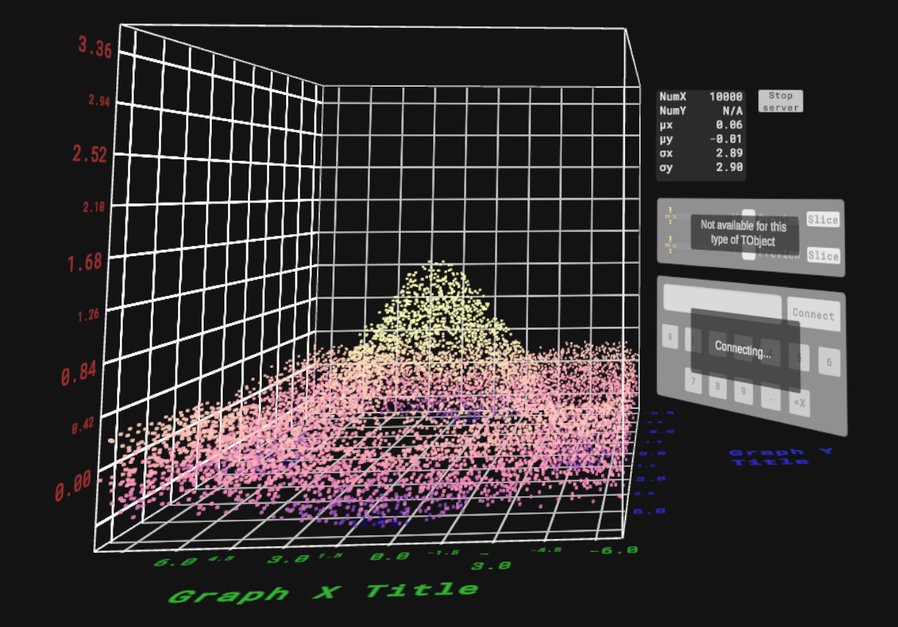
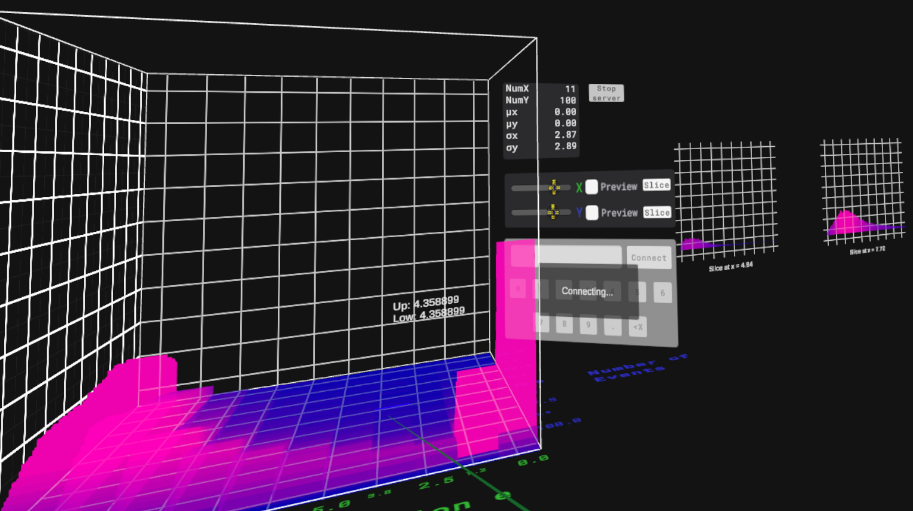
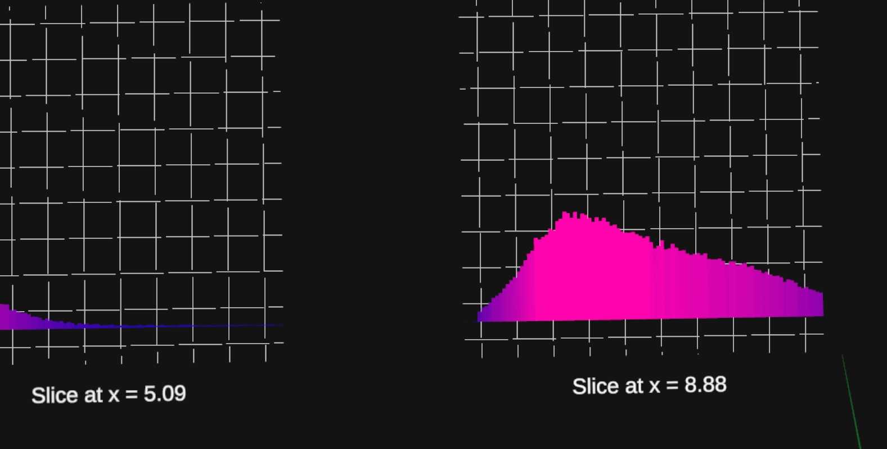
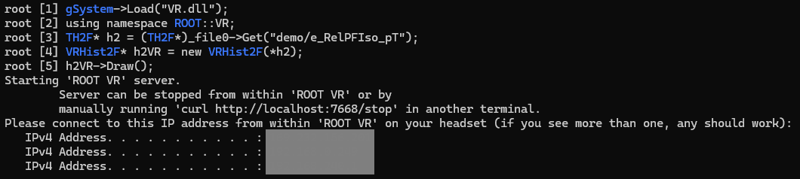

# ROOT VR By UCLA Physics

<p align = "center">
  
  
  <!---->
</p>
<p align = "center">VRGraph2D (left) and VRHist2F (right) example plots</p>

- [Overview](#overview)
- [Installation](#installation)
- [Network/Server FAQ](#networkserver-faq)
- [General Usage](#general-usage)
- [Getting Started](#getting-started)

## Overview
The goal of ROOT VR is to extend the ROOT particle physics data analysis package by introducing:
* Spatial immersion and perspective
* Real-time data interaction
* Higher-dimensional plots
* Dynamic plots (time-evolving plots of time-dependent data)

The visualization software is developed using the Unity engine, while the data objects (and associated processing) are implemented as new classes within ROOT. When the `Draw` method is called on any ROOT VR objects, a local HTTP server is launched; the visualiaztion software runs independently on the user's VR headset, from where the user can connect to this server.

<p align="center">
  
</p>

ROOT VR is currently supported on Windows (64-bit) and Linux (Ubuntu).

## Installation

This repository includes the necessary ROOT dictionary implementing ROOT VR objects, but not the VR visualization software itself; that can be found on the Meta AppLab. Please see <a href="https://vr.physics.ucla.edu/rootvr.html">vr.physics.ucla.edu</a> for more details. 

### Install Pre-Compiles Binaries for Windows

Please note that ROOT VR requires a 64-bit ROOT installation. You can check whether you have a 64-bit or 32-bit installation by running `root --version` in your terminal.

The recommended installation method is to download and run the ROOT VR installer (linked below). Doing so will download the ROOT VR client and associated ROOT dictionary, and append the latter to your `Path` environment variable. Upon uninstallation, this will be removed from `Path`. An uninstaller will be downloaded with the linked installer. If the above link is not functioning, you may want to clone this repository and manually run the file `ROOT_VR_installer.exe`.

* <a href="https://github.com/AryanMP16/ROOT_VR_PUBLIC/raw/refs/heads/master/ROOT_VR_installer.exe"> ROOT VR 0.10.0 Windows Win64 Installer</a>

### Install Pre-Compiled Binaries for Linux

The recommended installation method is to run the following command from within the directory in which you would like to install ROOT VR:

```
wget https://github.com/AryanMP16/ROOT_VR/raw/refs/heads/server-implementation/ROOT_src/ROOT_VR_Ubuntu_0_10_0.tar.gz
```

Afterwards, you may run `tar -xvzf ROOT_VR_Ubuntu_0_10_0.tar.gz` to extract the `.tar.gz` file. If you are unable to use `wget`, you may download the `.tar.gz` file from the following link. 

* <a href = "https://github.com/AryanMP16/ROOT_VR_PUBLIC/raw/refs/heads/master/ROOT_VR_Ubuntu_0_10_0.tar.gz"> ROOT VR 0.10.0 Ubuntu </a>

Prior to use, ensure that ROOT VR is in your `PATH` environment variable by running `export PATH="$PATH:/<path-to-ROOT-VR>/ROOT_src/build_linux"`.

### Install By Compiling Source

To install ROOT VR from source, clone this repository and navigate to `ROOT_src/build` (if running Windows) or `ROOT_src/build_linux` (if running Linux). From within that directory, run `cmake ..`, and afterwards `cmake --build . --config Release`. If you are running windows, you may need to manually move `VR.dll` out of `ROOT_src/build/Release` and into `ROOT_src/build` after building. Ensure that `<path-to-ROOT-VR>/ROOT_src/build` (or `<path-to-ROOT-VR>/ROOT_src/build_linux`) is in your `PATH` environment variable before using ROOT VR.

## Network/Server FAQ

1. "My headset is unable to connect to the server via IP address; the server is hosted on a Windows machine"

This is almost certainly a problem with the server-hosting computer's network settings. First, ensure that ROOT is allowed through your firewall: search up "Allow an app through Windows Firewall" in the Windows search bar and ensure ROOT is listed with a checkmark under both "Private" and "Public". If this doesn't work, search "Windows Defender Firewall with Advanced Security" in the Windows search bar, navigate to "Inbound Rules", click "New Rule...", select "Program", locate the ROOT executable (usually at /path/to/root/bin/root.exe), choose "Allow the connection", and ensure all 3 profiles are checked: "Domain", "Private", and "Public". Click "Finish" after naming the rule. Next, do the same process for "Outbound Rules". After all of these steps, the connection should work.

## General Usage

To use ROOT VR, load the dictionary in your ROOT session via `gSystem->Load("VR.dll");`. Currently supported objects include:

* VRGraph2D
* VRHist2F/I/D/L/C/S

In general, ROOT VR objects have two constructors: a default constructor (e.g. `VRHist2I h2;`) and one that takes a ROOT TObject (e.g. `VRGraph2D g2(existing_graph_obj);` where `existing_graph_obj` is a `TGraph2D`). In the latter use, the TObject argument must be of analogous type to the ROOT VR object, i.e. it is not possible to create `VRGraph2D g2(some_TH2_obj)`.

Every ROOT VR object supports the `Draw()` function, which launches the ROOT VR server as described in the "Overview" section above.

## Getting Started

To get the minimal working setup, we recommend using the `CMS_Public_Data_HZZ12.root` file included in this repository to view the VRHist2F object. In the directory with this file, run the following commands: to launch ROOT,

```
root -l HZZ12.root
```

Then, within ROOT,
```
root [1]  gSystem->Load("VR.dll");
root [2]  using namespace ROOT::VR;
root [3]  TH2F* h2 = (TH2F*)_file0_Get("demo/e_RelPFIso_pT");
root [4]  VRHist2F* h2VR = new VRHist2F(*h2);
root [5]  h2VR->Draw();
```

Then, open the ROOT VR app on your VR headset and enter the IP address(es) output by ROOT in your terminal.
